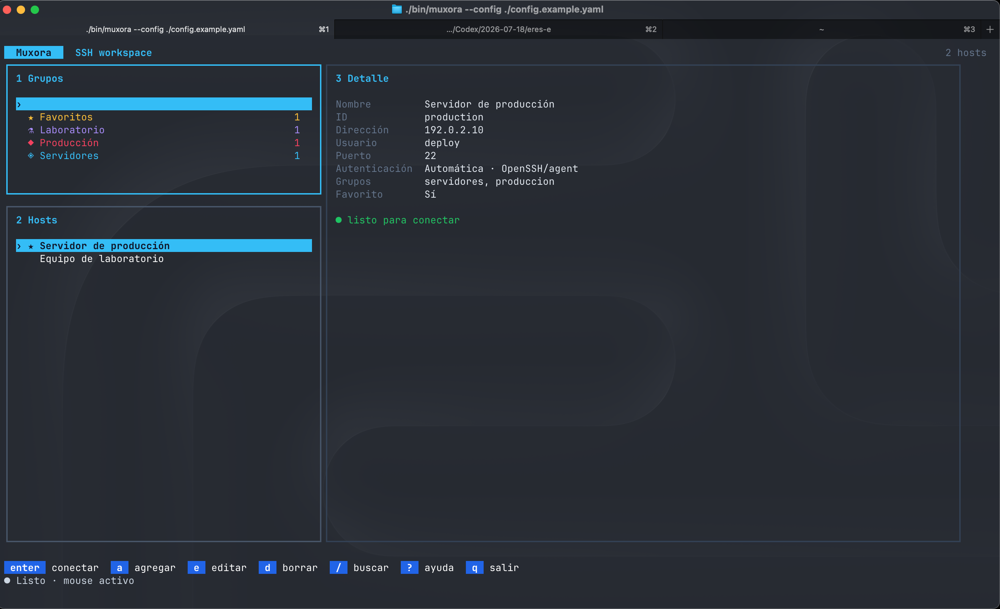

# Muxora

TUI extensible para administrar y abrir sesiones SSH desde un catálogo YAML. La primera versión usa el cliente OpenSSH del sistema, por lo que respeta `ssh-agent`, `known_hosts`, llaves y prompts de contraseña existentes.

## Vista previa



La interfaz organiza los grupos y hosts en paneles navegables, muestra los datos de la conexión seleccionada y permite administrar o iniciar sesiones SSH usando teclado o mouse.

## Documentación del proyecto

- [PROJECT.md](PROJECT.md): estado actual, decisiones y próximos pasos.
- [Arquitectura](docs/ARCHITECTURE.md): flujo detallado de configuración, TUI, PTY, sesiones y selección.
- [Instalación](docs/INSTALLATION.md): instalación global y estrategia de distribución como Lazygit.
- [Dependencias](docs/DEPENDENCIES.md): función y actualización de cada dependencia.
- [Publicación](docs/PUBLISHING.md): checklist para crear el repositorio y el primer release.
- [Contribuir](CONTRIBUTING.md): flujo de desarrollo, pruebas y pull requests.
- [Seguridad](SECURITY.md): cómo reportar vulnerabilidades y proteger configuraciones y logs.
- [Cambios](CHANGELOG.md): historial de versiones de Muxora.

## Inicio rápido como comando global

```bash
make check
make install
export PATH="$(go env GOPATH)/bin:$PATH"
muxora --version
muxora
```

La exportación del PATH debe añadirse una sola vez a `~/.zshrc`. Consulta la guía de instalación para usar `~/.local/bin` o preparar releases y Homebrew.

## 1. Requisitos en macOS

Este proyecto requiere Go 1.26 o posterior, OpenSSH y Git. OpenSSH ya viene incluido en macOS.

```bash
xcode-select --install
brew update
brew install go
go version
ssh -V
git --version
```

Si Homebrew no está instalado, sigue primero las instrucciones de [brew.sh](https://brew.sh/). Para otros sistemas operativos usa la guía oficial de instalación de [Go](https://go.dev/doc/install).

## 2. Descargar dependencias y comprobar el proyecto

Desde la raíz del repositorio:

```bash
go mod download
go test ./...
go build -o bin/muxora ./cmd/muxora
```

También se puede usar:

```bash
make test
make build
```

## 3. Instalar el comando

Instalación local en el GOPATH:

```bash
go install ./cmd/muxora
go env GOPATH
```

Añade la carpeta `bin` del GOPATH al `PATH` en `~/.zshrc` si aún no está:

```bash
export PATH="$(go env GOPATH)/bin:$PATH"
```

Recarga la shell:

```bash
source ~/.zshrc
muxora
```

Durante desarrollo también puedes ejecutar `./bin/muxora` o `go run ./cmd/muxora`.

## 4. Configuración YAML

En macOS, el archivo se crea automáticamente en:

```text
~/Library/Application Support/muxora/config.yaml
```

Puedes usar otra ruta con `--config`:

```bash
muxora --config ./config.example.yaml validate
muxora --config ./config.example.yaml
```

Ejemplo:

```yaml
version: 1
defaults:
  port: 22
  connect_timeout_seconds: 10
hosts:
  - id: production
    name: Producción
    address: 192.0.2.10
    user: deploy
    groups: [servidores, produccion]
    favorite: true
settings:
  theme: dark
  confirm_before_exit: true
```

Los grupos pueden tener símbolo y color propios:

```yaml
groups:
  - id: produccion
    name: Producción
    symbol: ◆
    color: "#F43F5E"
```

El color usa el formato hexadecimal `#RRGGBB`. Los hosts relacionan grupos mediante sus IDs en `groups`. Desde el panel **Grupos**, usa `a` para crear, `e` para editar y `d` para eliminar; los mismos atajos administran hosts cuando el panel **Hosts** está activo.

No guardes contraseñas en este archivo. Usa llaves SSH y `ssh-agent`.

## 5. Administrar hosts

```bash
muxora host add production "Producción" 192.0.2.10 deploy
muxora host list
muxora connect production
muxora host remove production
muxora validate
```

También puedes editar el YAML directamente. La escritura del programa es atómica y el archivo se guarda con permisos `0600`.

## 6. Controles de la TUI

| Tecla | Acción |
|---|---|
| `j`, `↓` | Siguiente host |
| `k`, `↑` | Host anterior |
| `Tab` | Cambiar entre Grupos y Hosts |
| `/` | Buscar por nombre, dirección, ID o grupo |
| `Enter` | Abrir sesión SSH |
| `a` | Agregar un host dentro de la TUI |
| `e` | Editar el host seleccionado |
| `d` | Eliminar con confirmación |
| `f` | Marcar o desmarcar favorito |
| `r` | Recargar cambios externos del YAML |
| `?` | Mostrar todos los atajos |
| `q` | Salir |

La pantalla usa un diseño responsivo inspirado en Lazygit y Tabby: grupos y hosts a la izquierda, con detalle o formulario contextual a la derecha. El mouse permite seleccionar grupos y hosts, usar la rueda para navegar y conectar al volver a pulsar el host seleccionado. En los formularios usa `Tab` para cambiar de campo, `Enter` o `Ctrl+S` para guardar y `Esc` para cancelar.

## Terminal SSH integrada

Al conectar, Muxora permanece abierto y transforma el panel derecho en una consola SSH interactiva. El proceso OpenSSH se ejecuta dentro de un PTY, acepta contraseñas, `ssh-agent`, `known_hosts`, comandos interactivos y se redimensiona junto con la ventana.

Cada nueva conexión crea una pestaña independiente dentro del panel 3. Las sesiones continúan ejecutándose al cambiar de pestaña o al volver al catálogo. Presiona `s` desde el catálogo para regresar a las sesiones abiertas.

Durante SSH, Muxora administra una selección propia limitada al contenido del panel 3. Arrastra sobre la salida SSH y, al soltar, únicamente ese texto se copia automáticamente al portapapeles de macOS mediante `pbcopy`; los grupos, hosts y bordes nunca forman parte de la selección. El fragmento elegido queda resaltado dentro de la consola. Las pestañas continúan disponibles mediante teclado o haciendo clic en su encabezado.

Durante una sesión:

| Tecla | Acción |
|---|---|
| `Ctrl+C` | Interrumpir el comando remoto |
| `Ctrl+D` | Enviar EOF al shell remoto |
| Flechas | Navegar en el shell remoto |
| `Ctrl+←`, `Ctrl+→` | Cambiar entre pestañas |
| `Ctrl+P`, `Ctrl+N` | Alternativa para cambiar de pestaña |
| `Ctrl+W` | Cerrar solamente la pestaña activa |
| `Ctrl+]` | Volver al catálogo sin cerrar sesiones |
| `Ctrl+R` | Iniciar o detener el recording de la sesión activa |

## Recording y logs de sesiones

Muxora puede guardar una transcripción independiente por pestaña. Al presionar `Ctrl+R` se abre un selector dentro del panel 3 para elegir la carpeta de destino. Al confirmar aparece `● REC`; al detenerlo o cerrar la sesión, el archivo termina con la hora de finalización.

El selector ofrece:

- Carpeta estándar de Muxora (`Ctrl+D`).
- `~/Documents/Muxora Logs` (`Ctrl+O`).
- `~/Desktop` (`Ctrl+T`).
- Cualquier ruta escrita manualmente.

También puedes hacer clic sobre los tres destinos rápidos. `Enter` confirma y `Esc` cancela sin iniciar la grabación.

Los logs se guardan por fecha en:

```text
~/Library/Application Support/muxora/logs/YYYY-MM-DD/
```

Consulta la ruta efectiva con:

```bash
muxora logs
```

Para grabar automáticamente toda nueva sesión:

```yaml
settings:
  record_sessions: true
  log_directory: ""
```

`log_directory` vacío usa la ruta estándar; también acepta una ruta como `~/Documents/muxora-logs`. Cada archivo tiene permisos `0600`, un encabezado con host, dirección, usuario y timestamps, seguido de texto plano sin secuencias ANSI.

Por seguridad Muxora no registra pulsaciones crudas. Los comandos aparecen cuando el shell remoto los refleja en la salida, mientras que contraseñas y passphrases escritas con echo desactivado no se guardan. Aun así, la salida de un comando puede contener secretos; protege y rota estos archivos según las políticas de tu organización.

## Arquitectura

```text
cmd/muxora/          CLI y punto de entrada
internal/config/     Esquema, validación y persistencia YAML
internal/sshclient/  Adaptador del cliente OpenSSH
internal/ui/         Modelo y vistas Bubble Tea
```

Los siguientes módulos previstos son `internal/session`, `internal/sftp`, `internal/vault` e `internal/tunnel`. La UI depende de adaptadores pequeños, lo que permite incorporar SFTP nativo y sesiones múltiples sin cambiar el formato base de hosts.

## Seguridad

- No se ejecutan comandos SSH mediante una shell: los argumentos se pasan directamente al proceso.
- Las contraseñas no forman parte del esquema YAML.
- Se conserva la verificación estándar de `known_hosts` de OpenSSH.
- El archivo de configuración generado usa permisos sólo para el usuario.

Las direcciones del ejemplo pertenecen a rangos reservados para documentación y no son hosts reales. Antes de publicar cambios, ejecuta `make check` y verifica que no hayas agregado configuraciones, llaves ni logs personales. Consulta [SECURITY.md](SECURITY.md) para reportar una vulnerabilidad sin divulgarla públicamente.

## Licencia

Muxora se distribuye bajo la [licencia MIT](LICENSE).
